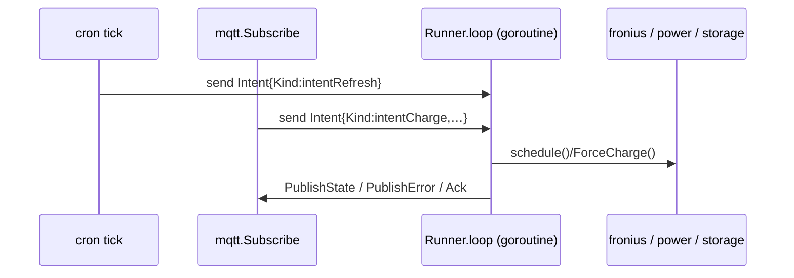

# Plan: MQTT feed (telemetry + control) with Home Assistant Discovery

> Slug: `64-issue-mqtt-feed` · Created: 2026-04-30
> Source issue: [#64](https://github.com/atbore-phx/sbam/issues/64)
> TASK: [64-issue-mqtt-feed-TASK.md](64-issue-mqtt-feed-TASK.md)
> Target release: **v2.0.0**

## 1. Task Analysis

**Goal.** Add an opt-in MQTT integration to sbam that publishes telemetry
on every schedule tick, accepts runtime commands over MQTT, and registers
itself in Home Assistant via MQTT Discovery — without changing any current
behavior when disabled.

**Non-goals.** No REST/HTTP API, no persistence, no web UI, no auth beyond
username/password + TLS, no Modbus surface beyond what `configure` already
exposes.

**Acceptance criteria.** See TASK §"Acceptance Criteria". Highlights:
identical v1.x behavior when off; one JSON `state` message per tick;
discovery configs published once per connect; commands routed through
existing `fronius` package; broker outage non-fatal.

## 2. Current State

- Single-tick scheduling logic lives in
  [pkg/cmd/schedule.go](../../../pkg/cmd/schedule.go) (`schedule()` and
  `crontabSchedule()`). All inputs already converge into local variables
  before invoking `pwr.Handler`, `str.Handler` and `scd.Handler`.
- Decision logic and the actual Modbus write live in
  [pkg/fronius/schedule.go](../../../pkg/fronius/schedule.go)
  (`SetFroniusChargeBatteryMode`, calling `ForceCharge`).
- Force-charge / restore-defaults primitives reused by the future
  `cmd/charge` and `cmd/stop` MQTT topics already exist:
  [pkg/fronius/configure.go](../../../pkg/fronius/configure.go).
- Cron loop uses `robfig/cron/v3` and blocks on a SIGINT/SIGTERM channel
  ([pkg/cmd/schedule.go](../../../pkg/cmd/schedule.go) `crontabSchedule`).
- Viper precedence / `bindFlags` in
  [pkg/cmd/root.go](../../../pkg/cmd/root.go); secret redaction registry in
  [src/utils/startup.go](../../../src/utils/startup.go) (issue #70).
- HA add-on env propagation in
  [home-assistant/addons/sbam/run.sh](../../../home-assistant/addons/sbam/run.sh)
  and schema in
  [home-assistant/addons/sbam/config.json](../../../home-assistant/addons/sbam/config.json).

Implication: today the schedule loop is invoked synchronously from `Run`.
To safely interleave cron ticks with incoming MQTT commands we will move
all execution behind a single intents channel.

## 3. Target Architecture

### Packages

```
pkg/
  mqtt/
    types.go        — Config, StatePayload, ErrorPayload, AckPayload, Intent
    client.go       — Client interface; Paho-backed implementation
    discovery.go    — HA MQTT Discovery payload builders
    commands.go     — cmd/* subscriber + payload validation
    publisher.go    — typed PublishState / PublishError / PublishAvailability
    mqtt_test.go    — round-trip + reconnect against mochi-mqtt/server
    discovery_test.go
    commands_test.go
  cmd/
    schedule.go     — modified: build mqtt.Client (or noop), pass to runner
    schedule_runner.go (new)
        — Runner serialising cron ticks + MQTT intents through one channel.
        — schedule_runner_test.go
```

`pkg/mqtt` MUST NOT import `pkg/cmd`, `pkg/fronius`, `pkg/power`, or
`pkg/storage`. It only knows about its own payload types and the
`Client` interface. The runner in `pkg/cmd` is the single place that
binds MQTT to the rest of sbam.

### Interfaces

```go
// pkg/mqtt/client.go
type Client interface {
    Connect(ctx context.Context) error
    PublishState(p StatePayload) error
    PublishError(src string, err error)
    PublishAvailability(online bool) error
    PublishDiscovery(d []DiscoveryEntity) error
    Subscribe(handler func(Intent)) error
    Disconnect(ctx context.Context) error
}

// Noop implementation returned when mqtt_enabled=false.
// All methods are zero-cost and never error.
type noop struct{}
```

`Intent` enumerates the runtime intents understood by the runner:

```go
type Intent struct {
    Kind       IntentKind // intentRefresh | intentCharge | intentStop |
                          // intentPause   | intentResume
    ChargePct  int16
    DurationS  int
    PausedUntil time.Time
    AckTopic   string
    AckID      string // correlation id, echoed in the ack payload
}
```

### Runner (`pkg/cmd/schedule_runner.go`)



Single goroutine, `for intent := range intents` over a buffered channel
(`cap=16`). Every cron tick and every MQTT command is converted into an
intent and pushed; the runner consumes serially. This eliminates races and
keeps Modbus writes single-threaded (Modbus TCP is not safe for concurrent
clients on the Fronius gen24+).

Pause state is held inside the runner only (in-memory, not persisted).
While paused, the runner still computes telemetry and publishes `state`
(with `decision="paused"`) but skips the `ForceCharge` call.

### Topic map

| Topic                                         | Direction | Retained | Purpose                       |
| --------------------------------------------- | --------- | -------- | ----------------------------- |
| `<base>/availability`                         | pub (LWT) | yes      | `online` / `offline`          |
| `<base>/state`                                | pub       | yes      | telemetry JSON per tick       |
| `<base>/error`                                | pub       | yes      | last error JSON               |
| `<base>/cmd/refresh\|charge\|stop\|pause\|resume` | sub   | no       | runtime commands              |
| `<base>/cmd/ack`                              | pub       | no       | command ack JSON              |
| `<discovery_prefix>/sensor/sbam_<id>/<key>/config` | pub  | yes      | HA discovery (per-entity)     |
| `<discovery_prefix>/binary_sensor/sbam_<id>/<key>/config` | pub | yes |                              |
| `<discovery_prefix>/button/sbam_<id>/<key>/config` | pub  | yes      |                              |

`<id>` is `sha1(fronius_ip)[:10]` for determinism across restarts (FR9).

## 4. Dependency Choices

Add to `go.mod`:

- `github.com/eclipse/paho.mqtt.golang` — production client. MIT-equivalent
  (EPL-2.0 + EDL-1.0). Mature, supports reconnect / TLS / LWT / QoS 0–2.
- `github.com/mochi-mqtt/server/v2` — test-only in-process broker
  (MIT). Keep behind a `_test.go` import so it doesn't bloat the binary.

Rejected:

- Bringing in a thin wrapper layer (e.g. `nats-mqtt`) — overkill for one
  feature.
- Implementing MQTT from scratch — out of scope for this issue.

No new runtime cgo. Binary stays `CGO_ENABLED=0`.

## 5. Configuration Changes

### CLI flags / env vars / yaml

All registered on `scdCmd` in `pkg/cmd/schedule.go` via the same
`Flags().StringVarP / Float64VarP / BoolVarP` pattern, so they
automatically pick up the flag > env > yaml > default precedence (issue
#68) and the startup parameter dump (issue #70).

| viper key               | env                    | yaml                  | flag                       | default          |
| ----------------------- | ---------------------- | --------------------- | -------------------------- | ---------------- |
| `mqtt_enabled`          | `MQTT_ENABLED`         | `mqtt_enabled`        | `--mqtt_enabled`           | `false`          |
| `mqtt_broker`           | `MQTT_BROKER`          | `mqtt_broker`         | `--mqtt_broker`            | `""`             |
| `mqtt_username`         | `MQTT_USERNAME`        | `mqtt_username`       | `--mqtt_username`          | `""`             |
| `mqtt_password`         | `MQTT_PASSWORD`        | `mqtt_password`       | `--mqtt_password`          | `""`             |
| `mqtt_client_id`        | `MQTT_CLIENT_ID`       | `mqtt_client_id`      | `--mqtt_client_id`         | `""` (auto)      |
| `mqtt_base_topic`       | `MQTT_BASE_TOPIC`      | `mqtt_base_topic`     | `--mqtt_base_topic`        | `sbam`           |
| `mqtt_qos`              | `MQTT_QOS`             | `mqtt_qos`            | `--mqtt_qos`               | `0`              |
| `mqtt_tls`              | `MQTT_TLS`             | `mqtt_tls`            | `--mqtt_tls`               | `false`          |
| `mqtt_ca_file`          | `MQTT_CA_FILE`         | `mqtt_ca_file`        | `--mqtt_ca_file`           | `""`             |
| `mqtt_ha_discovery`     | `MQTT_HA_DISCOVERY`    | `mqtt_ha_discovery`   | `--mqtt_ha_discovery`      | `true`           |
| `mqtt_discovery_prefix` | `MQTT_DISCOVERY_PREFIX`| `mqtt_discovery_prefix`| `--mqtt_discovery_prefix` | `homeassistant`  |

Update [src/utils/startup.go](../../../src/utils/startup.go):

```go
var SecretKeys = map[string]struct{}{
    "apikey":        {},
    "mqtt_password": {}, // new
}
```

### Home Assistant add-on

- [home-assistant/addons/sbam/config.json](../../../home-assistant/addons/sbam/config.json):
  add the eleven keys above under `options` with the defaults from the
  table; under `schema`, use `password` for `mqtt_password`,
  `bool` for the booleans, `int(0,1)` for `mqtt_qos`, and `str` for the
  rest. Bump the add-on `version` to `2.0.0`.
- [home-assistant/addons/sbam/run.sh](../../../home-assistant/addons/sbam/run.sh):
  `export MQTT_*=$(bashio::config '<key>')` for each new option.
- [home-assistant/addons/sbam/DOCS.md](../../../home-assistant/addons/sbam/DOCS.md):
  document the broker recommendation (Mosquitto add-on) and the auto-created
  HA entities.
- [home-assistant/addons/sbam/CHANGELOG.md](../../../home-assistant/addons/sbam/CHANGELOG.md):
  add `2.0.0` entry.

## 6. Implementation Blueprint

### Step 1 — Scaffold `pkg/mqtt`

1. Create `pkg/mqtt/types.go` with `Config`, `StatePayload`,
   `ErrorPayload`, `AckPayload`, `DiscoveryEntity`, `Intent`, `IntentKind`.
2. Create `pkg/mqtt/client.go` with the `Client` interface and two
   constructors:
   - `New(cfg Config) (Client, error)` — returns `noop{}` when
     `cfg.Enabled == false`; otherwise builds a Paho client preconfigured
     with LWT (`<base>/availability` = `offline`, retained, QoS 1),
     auto-reconnect (initial 1 s, cap 60 s, jitter), and TLS as configured.
   - `NewNoop() Client`.
3. Create `pkg/mqtt/publisher.go` with typed publish helpers wrapping
   `paho.Publish`. All helpers MUST swallow errors (log warn) so the
   scheduling hot path never sees an MQTT error.

### Step 2 — Discovery payloads (`pkg/mqtt/discovery.go`)

Pure function `BuildDiscovery(cfg Config, version string) []DiscoveryEntity`
returning one entity per FR8 item. Each entity carries:

```go
type DiscoveryEntity struct {
    Component  string // "sensor" | "binary_sensor" | "button"
    ObjectID   string // e.g. "battery_soc_pct"
    ConfigTopic string // <prefix>/<component>/sbam_<id>/<object>/config
    Payload    map[string]any // serialisable directly to JSON
}
```

The `Payload` map is the HA discovery JSON. Reusable bits
(`device`, `availability`, `unique_id`, `state_topic`,
`value_template`) are factored into private helpers and unit-tested.

### Step 3 — Commands (`pkg/mqtt/commands.go`)

`func ParseIntent(topic string, payload []byte) (Intent, error)` — a pure,
table-driven parser. The subscriber goroutine inside the Paho client
forwards every received message to this function, then sends the resulting
`Intent` (or an error ack) on the channel returned by
`Client.Subscribe(handler)`.

Validation rules (FR enforcement):

- `cmd/charge`: JSON must include `pct ∈ [0, 100]` and optional
  `duration_s ≥ 0`. Anything else → ack `accepted=false`.
- `cmd/pause`: `until` must parse as RFC3339 OR a Go `time.ParseDuration`
  string; resulting absolute deadline cannot be in the past.
- All other commands take an empty payload (or `{}`).

### Step 4 — Runner (`pkg/cmd/schedule_runner.go`)

Move the body of `schedule(...)` into a `Runner` type:

```go
type Runner struct {
    cfg     RunnerConfig // all the existing scalar args, grouped
    mqtt    mqtt.Client
    intents chan mqtt.Intent
    paused  atomic.Pointer[time.Time]
}

func (r *Runner) Loop(ctx context.Context) error
func (r *Runner) Tick(now time.Time) // executes one schedule cycle
```

`crontabSchedule` is rewritten to:

1. Build the runner.
2. Connect MQTT (no-op if disabled).
3. Publish discovery + availability=online.
4. Register a cron job that pushes `Intent{Kind:intentRefresh}` onto
   `r.intents`.
5. Start `mqtt.Subscribe(func(i Intent){ r.intents <- i })`.
6. Block on `r.Loop(ctx)` until SIGINT/SIGTERM cancels `ctx`.
7. On shutdown: publish availability=offline, `mqtt.Disconnect(ctx)`.

The single-shot `schedule(...)` path (no crontab) remains supported and
also goes through one `r.Tick(now)` call followed by an immediate
shutdown.

### Step 5 — Telemetry assembly

Inside `Runner.Tick`, after `pwr.Handler` and `str.Handler` succeed and
`fronius.Handler` returns `charge_pct`, build a `StatePayload` from the
local variables, derive `decision` from the same conditions evaluated by
`SetFroniusChargeBatteryMode` (extract those conditions into a small
`func ClassifyDecision(...) string` in `pkg/fronius/schedule.go` so the
runner and the Modbus path share one source of truth), and
`r.mqtt.PublishState(payload)`.

On any error, `r.mqtt.PublishError("schedule", err)` then continue (do not
panic — the cron loop must survive transient failures). The existing
`panic(err)` calls in `schedule()` are replaced by error returns; this is
a behavior change limited to the cron mode, where it is desirable.

### Step 6 — Wiring

- `pkg/cmd/schedule.go`:
  - Read every `mqtt_*` viper key into the runner config.
  - Construct `mqtt.Client` once, pass to the runner.
  - Add a `Run` defer that calls `r.Shutdown(ctx)` on signal.
- `src/utils/startup.go`:
  - Append `mqtt_password` to `SecretKeys`.
- HA add-on files: as described in §5.

### Step 7 — Documentation

- Update `README.md` with a short "MQTT integration" section linking to the
  HA add-on docs and listing the topic map.
- Update [.github/copilot-instructions.md](../../../.github/copilot-instructions.md)
  "Project Structure" block to include `pkg/mqtt/` and
  `pkg/cmd/schedule_runner.go` (per the maintenance rule already stated in
  that file).

## 7. Test Plan

| Package        | Expected                                                 | Edge                                              | Failure                                                 | Mocks                                       |
| -------------- | -------------------------------------------------------- | ------------------------------------------------- | ------------------------------------------------------- | ------------------------------------------- |
| `pkg/mqtt`     | publish/subscribe round-trip on `state` + LWT triggers   | broker restart mid-run; reconnect republishes     | bad creds; malformed `cmd/charge`; QoS out of range     | `mochi-mqtt/server/v2` in-process           |
| `pkg/mqtt`     | discovery JSON contains `device`, `unique_id`, etc.      | empty `mqtt_client_id` auto-derives a stable one  | invalid `mqtt_ca_file` returns wrapped error            | none (pure functions)                       |
| `pkg/cmd`      | one tick → one `state` publish for each decision branch  | `cmd/refresh` triggers an extra tick out-of-band  | broker outage during tick logs warn, tick still writes  | `mbserver` + `httptest` + fake `mqtt.Client`|
| `pkg/cmd`      | `cmd/charge` invokes the same `ForceCharge` as configure | `cmd/pause` blocks Modbus writes until `resume`   | unknown `cmd/foo` produces `accepted=false` ack         | same                                        |
| `pkg/fronius`  | unchanged                                                | `ClassifyDecision` covers all four branches       | unchanged                                               | `mbserver`                                  |
| `src/utils`    | `mqtt_password` redacted in dump                         | n/a                                               | n/a                                                     | none                                        |

`defer` cleanup reminder: every test starting an in-process broker MUST
`defer broker.Close()`; tests that mutate `utils.SecretKeys` MUST restore
it via `t.Cleanup`.

## 8. Validation Gates

The implementer MUST run and pass, in order:

1. `go mod tidy` after adding the two new modules.
2. `make test` — full suite green.
3. `go test ./pkg/mqtt/...` — focused run of new tests.
4. `go test ./pkg/cmd/...` — regression check for runner + precedence + dump.
5. `make build` — `bin/sbam` builds with `CGO_ENABLED=0`; binary size delta
   reported in the PR description (paho is small but worth tracking for a
   v2 bump).
6. Manual smoke against a local Mosquitto:
   - `MQTT_ENABLED=true MQTT_BROKER=tcp://127.0.0.1:1883 DEBUG=true ./bin/sbam schedule …`
   - Subscribe with `mosquitto_sub -t 'sbam/#' -v` and confirm `state`,
     `availability=online`, and (if HA on the same broker) the device
     appears under Settings → Devices & Services → MQTT.
   - `mosquitto_pub -t sbam/cmd/refresh -m '{}'` → extra tick + ack.
   - Stop and restart the broker → sbam keeps scheduling, reconnects, and
     republishes discovery + availability.
7. HA add-on smoke: build the add-on locally
   ([home-assistant/addons/test_local.sh](../../../home-assistant/addons/test_local.sh))
   with the new `config.json` and confirm the add-on starts with MQTT
   options visible in the UI.

## 9. Rollout

- Tag `v2.0.0` only after gates §8.1–§8.6 pass.
- HA add-on `version` bumped to `2.0.0` in `config.json` and
  `CHANGELOG.md`.
- Migration notes in `README.md`: existing users upgrading from v1.x
  experience **no behavior change** unless they explicitly set
  `MQTT_ENABLED=true`. No config file migration required.
